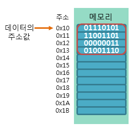

# 4.1 변수란 무엇인가
- 애플리케이션의 기본은 데이터를 입력 -> 처리 -> 출력
- **변수**: 데이터를 관리하기 위한 것

> 자바스크립트 엔진이 10 + 20 이라는 식의 의미를 해석하자면 + 연산을 수행하기 위해 먼저 + 연산자의 좌변과 우변의 숫자 값을 기억한다. </br>
컴퓨터는 CPU를 사용해 연산하고, 메모리를 사용해 데이터를 기억한다. </br>

- **메모리**: 데이터를 저장할 수 있는 메모리 셀의 집합체
- 메모리 셀 하나의 크기는 1바이트(8비트)이며, 1바이트 단위로 데이터를 저장하거나 읽음
- 각 셀은 고유의 메모리 주소를 갖음
- 메모리에 저장되는 모든 값은 2진수로 저장



> 10과 20은 메모리 상의 임의의 위치(메모리 주소)에 기억(저장)되고 CPU는 이 값을 읽어 연산을 수행한다. </br>
연산 결과로 생성된 숫자 값(30)도 메모리 상의 임의의 위치에 저장된다. </br>
문제는 30을 재사용할 수 없다. </br>
메모리 주소에 직접 접근해서 사용할 수 있지만 이 이것은 치명적 오류를 발생시킬 위험이 높다. </br>
따라서 js 개발자의 직접적인 메모리 제어를 허용하지 않는다. </br>
또한 값이 저장될 메모리 주소는 코드가 실행될 때마다 임의로 결정되어서 고정적이지않다.


- 다시 **변수**란 하나의 값을 저장하기 위해 확보한 메모리 공간 자체 또는 그 메모리 공간을 식별하기 위해 붙인 이름 즉, **값의 위치를 가리키는 상징적인 이름**이다.
- 컴파일러 혹은 인터프리터의 의해 값이 저장된 메모리 공간의 주소로 치환되어 실행한다. 
- 따라서 직접 메모리 주소를 통해 값을 저장하고 참조할 필요가 없이 변수를 통해 접근이 가능하다.

### 변수를 저장하는법
```js
// 하나씩
const userId = 1
const userName = "admin"

// 객체나 배열 이용해 그룹화
const user = {"id": 1, name: "admin"}

const users = [
    {"id": 1, name: "admin"},
    {"id": 2, name: "test"}
]
```

- **변수 값**: 메모리 공간에 저장된 값을 식별할 수 있는 고유한 이름을 변수 이름(명) 그리고 변수에 저장된 값
- **할당(대입, 저장)**: 변수에 값을 저장하는 것
- **참조**: 변수에 저장된 값을 읽는 것

--------------------------------------------------------

# 4.2 식별자
- **식별자**: 변수 이름
- 어떤 값을 구별해서 식별할 수 있는 고유한 이름을 말한다.
- 값은 메모리 공간에 저장되어 있다. 
- 따라서 식별자는 메모리 공간에 저장되어 있는 어떤 값을 구별해서 식별할 수 있어야한다. 
- 이를 위해 어떤 값이 저장되어 있는 메모리 주소를 기억해야한다.

> 식별자 result는 30을 식별할 수 있다. result는 30이 저장된 메모리 주소 0x054F123을 기억해야한다. </br>
다시말해 식별자는 값이 아니라 메모리 주소를 기억하고 있다. 

- 식별자는 메모리 주소에 붙인 이름이라고 할 수 있다. 
- 변수 뿐만이 아니라 메모리 상에 존재하는 어떤 값을 식별할 수 있는 이름(변수, 함수, 클래스의 이름) 모두 식별자라고 부른다

--------------------------------------------------------

# 4.3 변수선언
- **변수 선언**: 변수 생성과 동일
- 값을 저장하기 위한 메모리 공간을 확보하고 변수 이름과 확보된 메모리 공간의 주소를 연결해서 값을 저장할 수 있게 준비하는 것이다.
- 변수 선언에 의해 확보된 메모리 공간은 해제 전까지 보호된다.

> ! var는 블록 레벨 스코프를 지원하지 않고 함수 레벨 스코프를 지원하기 때문에 의도치 않게 전역 변수가 선언되어 부작용이 발생함 </br>
이를 위해 ES6에서 const와 let을 도입했다.


- 변수를 선언한 이후, 아직 변수에 값을 할당하지 않았다. 
- 그러나 메모리 공간이 비어있는 것이 아니라 자바스크립트 엔진에 의해 undefined라는 값이 암묵적으로 할당되어 초기화된다.
1. 선언단계: 변수 이름을 등록해서 js 엔진에 변수의 존재를 알림
2. 초기화단계: 값을 저정하기 위한 메모리 공간을 확보하고 암묵적으로 undefined를 할당

- 만약 선언하지 않는 식별자에 접근하면 'ReferenceError(참조에러)가 발생한다.

--------------------------------------------------------

# 4.4 변수 선언의 실행 시점과 변수 호이스팅
- 변수 선언문 보다 변수를 참조하는 코드가 앞에 있다면 RefereneceError가 발생하지 않고 undefined가 출력된다.
- 이유는 변수 선언이 소스코드가 한 줄씩 순차적으로 실행되는 시점, 즉 런타임이 아니라 그 이전 단계에서 먼저 실행되기 때문이다.
- JS엔진은 변수 선언이 소스코드의 어디에 있든 상관없이 다른 코드보다 먼저 실행한다. 
- 변수 선언문이 코드의 선두로 끌어 올려진 것처럼 동작하는 JS고유의 특징을 변수 호이스팅이라고 한다.

--------------------------------------------------------

# 4.5 값의 할당
- 값을 할당할 때는 할당 연산자 '='을 사용한다. 
- 우변의 값을 좌변의 변수에 할당한다.
- JS엔진은 변수 선언과 값의 할당을 하나의 문으로 단축 표현해도 변수 선언과 값의 할당을 2개의 문으로 나누어 각각 실행한다.
- 변수 선언은 코드가 순차적으로 실행되는 시점인 런타임 이전에 먼저 실행되지만, 
- 값의 할당은소스코드가 실행되는 시점인 런타임에 실행된다.

```js
// undefined가 저장된 메모리 공간을 지우고 100을 할당하는 것이 아니라 새로운 메모리 공간을 확보하고 그 할당 값 100을 저장한다.
const score;
score = 100;

// 동일하다.
const score = 100;
```

--------------------------------------------------------

# 4.6 값의 재할당
- **재할당**: 이미 값이 할당되어 있는 변수에 새로운 값을 다시 할당하는 것을 말한다.
- 재할당은 벼수에 저장된 값을 다른 값으로 변경한다. 
- 만약 재할당할 수 없어서 변수에 저장된 값을 변경할 수 없다면 상수라고 한다. 
- 즉 상수는 단 한 번만 할당할 수 있는 변수이다.
> var, let은 재할당이 되지만 const는 재할당이 금지된다.

- 재할당을 하면 새로운 메모리 공간을 확보하고 그 메모리 공간에 새로운 값을 저장한다. 
- 재할당 이전의 값은 어떤 변수 값으로 갖고 있지 않은 상태가 되는데 이런 값들은 **가비지 콜렉터**에 의해 메모리에서 자동 해제된다. 
> 메모리에서 언제 해제될지는 알 수 없다. C언어에는 malloc()과 free() 같은 저수준 메모리 제어 기능이 있지만 JS에서는 허용하지 않는다. </br>
일부 성능 손실은 감수해야한다.

--------------------------------------------------------

# 4.7 식별자 네이밍 규칙
- 식별자는 특수문자를 제외한 문자, 숫자, 언더스코어, 달러 기호를 포함할 수 있다. 
- 단 특수문자를 제외한 문자, 언더스코어, 달러 기호로 시작해야한다. 
- 숫자 시작은 비허용.
- 예약어도 불가
- JS는 대소문자를 구별한다.
- 의미를 명확히 표현하는게 좋다.

### 예약어 참고
- http://www.w3bai.com/ko/js/js_reserved.html

### 네이밍 컨벤션
- 카멜 케이스 : firstName
- 스케이크 케이스 : first_name
- 파스칼 케이스 : FirstName
- 헝가리언 케이스 : strFirstName // type+identifier